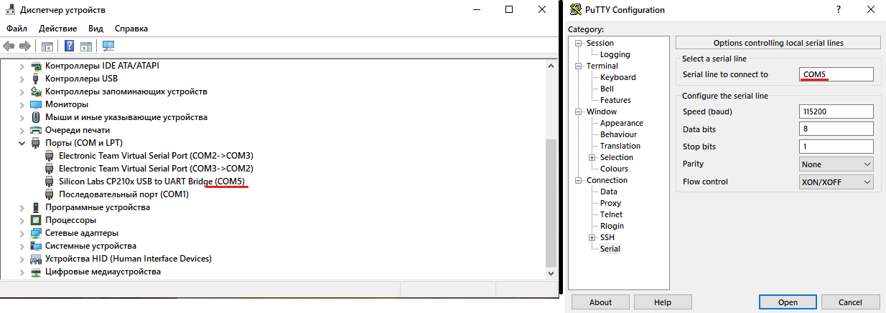
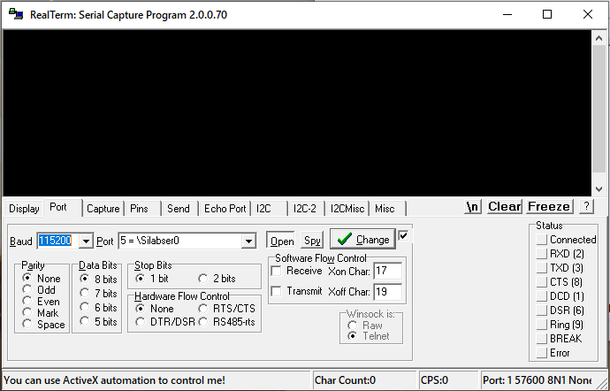
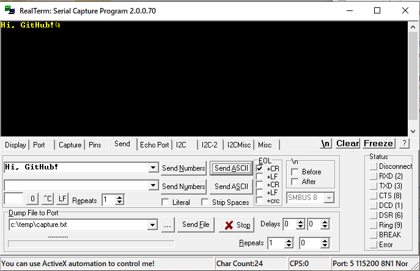
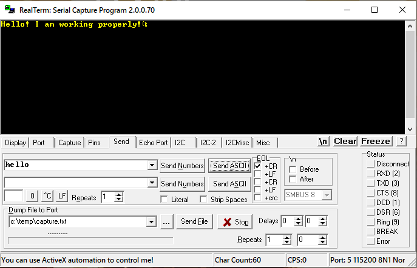

# Прием-передача ASCII сообщений по USART1 на микроконтроллере STM32F103C8T6

# Описание
Программа реализована в Keil MDK v.5.

Данная программа производит прием-передачу ASCII сообщений по протоколу UART с использованием прерываний. 
Принимаемые на стороне МК данные затем отправляются обратно. В случае передачи сообщения "hello", Мк отправляет фразу: "Hello! I am working properly!".

При работе используются два буфера: входной буфер RX_buf, емкостью 80 знаков; выходной буфер TX_bufer, емкостью 80 знаков.
По прерыванию RXNE происходит прием и загрузка пришедшего значения во входной буффер RX_buf, которые затем загружаются
в выходной буфер TX_buf, формируя сообщение.
По прерыванию TXE происходит передача значения из выходного буффера TX_buf.
В случае переполнения одного из буфферов выводится соответствующее сообщение, после чего программа переходит в вечный цикл:
```C
while(1) {}
```

# Приготовления к началу работы (Windows)
Проект предназначен для работы на микроконтроллере STM32F103C8T6. 
Для начала работы необходимо подключить микроконтроллер для загрузки программы. (например, с помощью ST-LINK V2).
В качестве файла для прошивки нужно выбрать uart.hex, находящийся в репозитории, папка uart/Objects.
 
Для передачи данных по последовательному COM-порту следует подключить к соответствующим ножкам микроконтроллера
питание, а также линии приема/передачи:
 - pin A9 - TX (передача данных);
 - pin A10 - RX (прием данных).

# Проверка работы на ПК (Windows)
 Для работы через последовательный порт необходимо воспользоваться терминальной программой. Например:
 - PuTTY: https://www.chiark.greenend.org.uk/~sgtatham/putty/
 - Realterm: https://sourceforge.net/projects/realterm/
 
 Для подключения к ПК через USB-порт можно воспользоваться соответствующими переходниками USB-UART.
 После подключения к ПК соответствующий микроконтроллеру номер порта появится в диспетчере устройств, вкладка Порты(COM и LPT).
 Через терминальную программу подключаемся к порту МК с настройками:
 - baudrate: 112500;
 - биты данных: 8;
 - биты остановки: 1;
 - бит чётности: нет.
 
 
 
 # Пример работы в Realterm
  
  
  
 
 
 # Автор
 Krikun18
